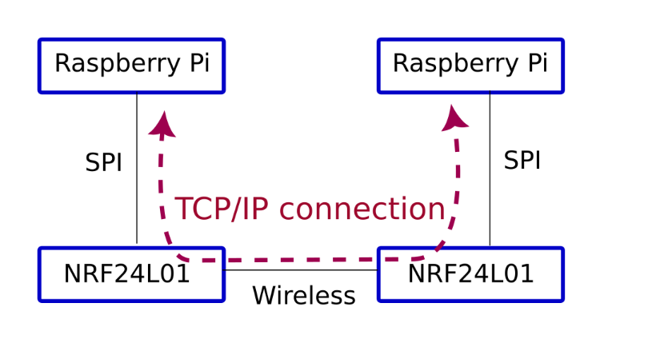

# longer range TCPIP via NRF24L01 for a pair of Raspberry PIs

## Intro

This tutorial is trying to use `NRF24L01` to create a TCP/IP link between two Raspberry Pi boards.
Due to long range of NRFs, some of those have 1800 meter wireless range, it would be good to have a TCPIP link between two RPi via NRFs so it would be possible to have a TCPIP connection between two RPi in longer range. The onboard wifi of RPi cannot do long ranges like 50 meter even in clear sight. 



## Hardware Configuration

1. wiring: Here is how I did connect the module to the RPi as described in the main RF24 documentation [here](https://nrf24.github.io/RF24/#autotoc_md227).
2. Noise on 3.3v on RPi: Put some capacitor or L-C filter to reduce the noise on 3.3v supply from RPi.
3. Shielding PA/LNA module: Shield your radio module, if it has none. See more details [in the RF24 Common Issues document](https://github.com/nRF24/RF24/blob/master/COMMON_ISSUES.md#my-palna-module-fails-to-transmit)

## Software Configuration

1. Enable SPI from [`raspi-config`](https://www.raspberrypi.com/documentation/computers/configuration.html#raspi-config). Select "Interface Options" -> "SPI" -> "Yes" -> "Ok", then exit and reboot the RPi (`sudo reboot`).
2. Install nRF24 library stack on each machine. See more detail in the [RF24 docs](https://nrf24.github.io/RF24/md_docs_2linux__install.html). 

```text
sudo apt-get update
sudo apt-get upgrade
wget https://raw.githubusercontent.com/nRF24/.github/main/installer/install.sh
chmod +x install.sh
./install.sh
```
Installer will promp which modules you want to install. I did installed all modules: "RF24", "RF24Network" "RF24Mesh" "RF24Gateway". Also please select `SPIDEV` driver during installation.

after installation done, and if there are no errors in the process, there will be these directories inside the RPi:

```text
~/rf24libs/RF24
~/rf24libs/RF24Network
~/rf24libs/RF24Gateway
~/rf24libs/RF24Mesh
```

Next we need to choose a master/primary node (as discussed [here](https://github.com/nRF24/RF24Gateway/issues/41)). so one RPi will be primary, and another one will be secondary. we'll use the official example named `ncurses` in [RF24 repo](https://github.com/nRF24/RF24Gateway/tree/master/examples/ncurses) to establish the network.
this code is already cloned to local device in process of installation. so we need to have some edits on the code. On the Master/Primary machine no need to do edits, but on the secondary machine we need to edit `~/rf24libs/RF24Gateway/examples/ncurses/RF24Gateway_ncurses.cpp` file, first lines of method `main()`

Before edit (first lines)
```cpp
int main()
{

    gw.begin();
    //mesh.setStaticAddress(8, 1);

    //uint8_t nodeID = 22;
    //gw.begin(nodeID,3,RF24_2MBPS);

    //uint16_t address = 0;
    //gw.begin(address,3,RF24_2MBPS);
```
after edit:
```cpp
int main()
{

    //gw.begin();
    //mesh.setStaticAddress(8, 1);

    uint8_t nodeID = 3;
    gw.begin(nodeID);

    //uint16_t address = 0;
    //gw.begin(address,3,RF24_2MBPS);
```

Again, the above edit is only done in the secondary machine, the primary machine needs no edits.

Next, we need to recompile the ncurses example and run it in the terminal:

```text
cd ~/rf24libs/RF24Gateway/examples/build
make
```

### Primary machine config

```text
sudo ip tuntap add dev tun_nrf24 mode tun user pi multi_queue
sudo ifconfig tun_nrf24 10.11.2.2/24
```

The following commands can be run to modify the default TCP/IP window sizes. This can severely impact other network
functionality. Run `sudo sysctl net.ipv4.tcp_wmem` and `sudo sysctl net.ipv4.tcp_rmem` to get the defaults so they can be 
restored.

```
sudo sysctl net.ipv4.tcp_wmem="1500 1500 1500"
sudo sysctl net.ipv4.tcp_rmem="1500 1500 1500"
```
These changes are only temporary and need to be run each time after reboot of the operating system.

### Secondary machine config

```text
sudo ip tuntap add dev tun_nrf24 mode tun user pi multi_queue
sudo ifconfig tun_nrf24 10.11.2.3/24
```

The following commands can be run to modify the default TCP/IP window sizes. This can severely impact other network
functionality. Run `sudo sysctl net.ipv4.tcp_wmem` and `sudo sysctl net.ipv4.tcp_rmem` to get the defaults so they can be 
restored.

```
sudo sysctl net.ipv4.tcp_wmem="1500 1500 1500"
sudo sysctl net.ipv4.tcp_rmem="1500 1500 1500"
```
These changes are only temporary and need to be run each time after reboot of the operating system.

### Run the ncurses example on both machines

```text
cd ~/rf24libs/RF24Gateway/examples/build/ncurses
./RF24Gateway_ncurses
```

Done. The primary machine IP is `10.11.2.2`, and the secondary machine IP is `10.11.2.3`.
One could ping machines from each other.

```text
pi@pi:~ $ ping 10.11.2.2 -c10
PING 10.11.2.2 (10.11.2.2) 56(84) bytes of data.
64 bytes from 10.11.2.2: icmp_seq=1 ttl=64 time=15.6 ms
64 bytes from 10.11.2.2: icmp_seq=2 ttl=64 time=13.6 ms
64 bytes from 10.11.2.2: icmp_seq=3 ttl=64 time=14.2 ms
64 bytes from 10.11.2.2: icmp_seq=4 ttl=64 time=14.8 ms
64 bytes from 10.11.2.2: icmp_seq=5 ttl=64 time=13.0 ms
64 bytes from 10.11.2.2: icmp_seq=6 ttl=64 time=14.9 ms
64 bytes from 10.11.2.2: icmp_seq=7 ttl=64 time=14.0 ms
64 bytes from 10.11.2.2: icmp_seq=8 ttl=64 time=14.0 ms
64 bytes from 10.11.2.2: icmp_seq=9 ttl=64 time=14.1 ms
64 bytes from 10.11.2.2: icmp_seq=10 ttl=64 time=14.7 ms

--- 10.11.2.2 ping statistics ---
10 packets transmitted, 10 received, 0% packet loss, time 9013ms
rtt min/avg/max/mdev = 13.014/14.281/15.603/0.698 ms
```

The resulting latency when pinging primary machine from secondary is about 14 millisecond. Let's check the transfer speed. The speed, most of the times, is about `10 kB/s` (equal to 100K bits per second) but sometimes less. `5 kB/s` should be good approximation for an average.

